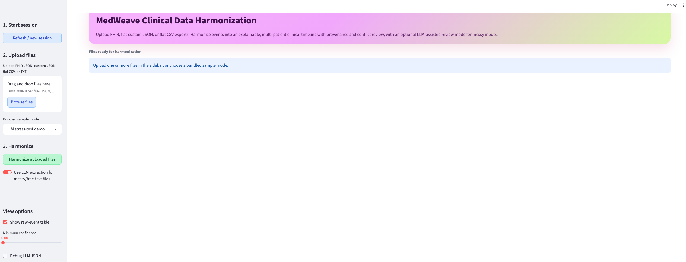
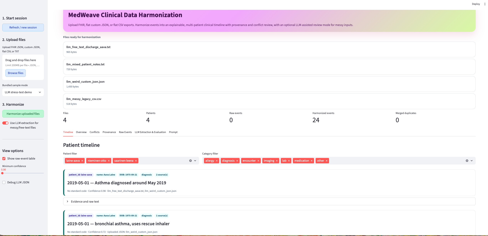

# MedWeave Clinical Data Harmonization

**MedWeave Clinical Data Harmonization** is a Streamlit application for harmonizing multi-source clinical/EHR files into an explainable patient timeline.

It supports structured and messy healthcare data, including FHIR bundles, custom JSON exports, flat CSV files, and free-text clinical notes. The app combines deterministic parsing with optional LLM-assisted extraction for ambiguous or free-text records.





## Features

* Upload multiple clinical files at once
* Supports FHIR JSON, custom JSON, flat CSV, and TXT notes
* Extracts diagnoses, medications, labs, vitals, procedures, imaging, encounters, and allergies
* Builds a unified patient timeline
* Preserves provenance from original source files
* Handles multi-patient datasets
* Separates `patient_id`, `patient_name`, and `patient_dob`
* Optional OpenAI-powered extraction for messy/free-text files
* Conflict and evaluation panels for review
* CSV and JSON export

## Why MedWeave?

Clinical data often arrives in incompatible formats:

* FHIR resources from hospital systems
* flat CSV exports from labs or pharmacy systems
* custom JSON from clinic software
* free-text discharge summaries and copied legacy notes

MedWeave turns these heterogeneous sources into a single explainable timeline while keeping source evidence visible.


## Installation

```bash
git clone https://github.com/YOUR_USERNAME/medweave-clinical-data-harmonization.git
cd medweave-clinical-data-harmonization

python -m venv .venv
source .venv/bin/activate   # Windows: .venv\Scripts\activate

pip install -r requirements.txt
```

## LLM extraction and API keys

MedWeave can run in two modes:

1. **Rule-based mode**
   This is the default mode. It does not require an OpenAI API key. It can parse and harmonize structured FHIR, JSON, and CSV files using deterministic logic.

2. **LLM extraction mode**
   This is optional. It is useful for messy files, free-text clinical notes, unusual CSV columns, and non-standard JSON schemas. To use this mode, each user must provide their own OpenAI API key.

Create a local `.env` file:

```bash
OPENAI_API_KEY=your_own_openai_api_key_here
OPENAI_MODEL=gpt-4.1-mini
```

Do not commit `.env` to GitHub.

The repository includes `.env.example` as a safe template. Users should copy it:

```bash
cp .env.example .env
```

Then add their own key.

If no API key is provided, the app should still run in rule-based mode, but LLM extraction will be disabled or show a warning.

Important privacy note: do not send real patient data to external LLM APIs unless you have appropriate legal, ethical, institutional, and security approvals.

## Run the app

```bash
streamlit run app.py
```

Then open the local Streamlit URL in your browser.

## Using the app

1. Upload one or more clinical files.
2. Choose whether to enable LLM extraction for messy/free-text files.
3. Click **Harmonize uploaded files**.
4. Review the Timeline, Overview, Conflicts, Provenance, Raw Events, and LLM Extraction tabs.
5. Export the harmonized timeline as CSV or JSON.
6. Use **Refresh / new session** to clear results.

## Sample data

The repository includes synthetic sample data for testing:

* single-patient FHIR/JSON/CSV examples
* multi-patient synthetic examples
* LLM stress-test examples with messy text, JSON, and CSV

All sample data are fictional.


## Testing

```bash
pytest
```

## Safety and privacy

This project is for research, education, and prototyping. Before using real patient data:

* remove or minimize PHI
* do not send sensitive patient data to external APIs without proper approval
* use compliant infrastructure
* add authentication, encryption, logging, and access control
* keep human clinical review in the loop

## Roadmap

* Stronger FHIR resource coverage
* Better terminology mapping
* More robust patient identity resolution
* LLM extraction evaluation dashboard
* Batch processing for larger datasets
* Deployment-ready backend API
* Role-based access control
* Audit logging

## License

MIT License
